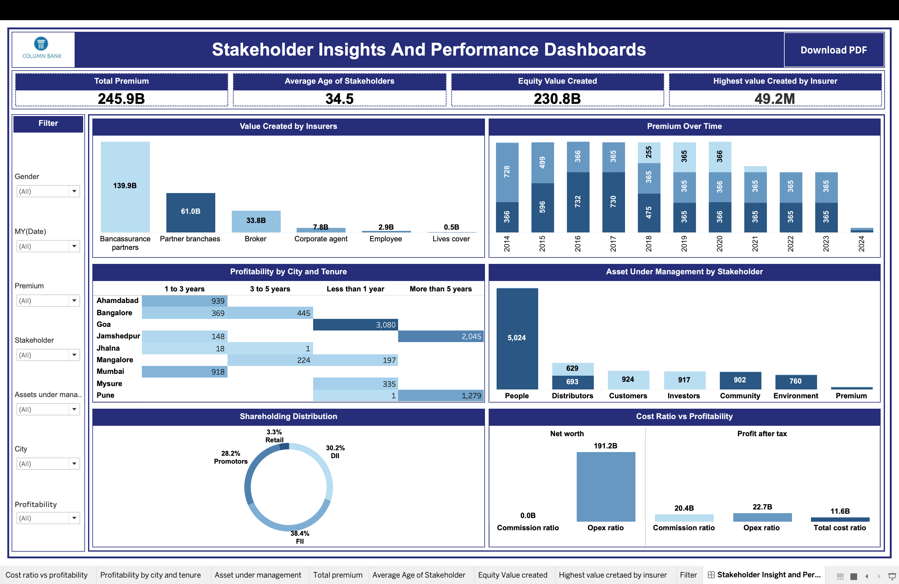

# Stakeholder-Insights-Performance-Dashboard
Interactive Tableau dashboard analysing stakeholder performance, premium trends, profitability, asset management and equity value creation.

# Stakeholder Insights & Performance Dashboard

## 📊 Project Overview

This project presents an interactive **Tableau dashboard** designed to analyze stakeholder performance, premium trends, profitability, asset under management, and value creation.

The dashboard provides a consolidated view of key business metrics and allows users to explore performance across different stakeholder categories, cities, tenure periods, and other business dimensions.

## 🎯 Objectives

* Analyze total premium and equity value created.
* Compare value created across different insurers/stakeholders.
* Understand premium trends over time.
* Analyze profitability based on city and stakeholder tenure.
* Compare assets under management across stakeholder categories.
* Analyze shareholding distribution.
* Evaluate cost ratios against profitability.
* Provide an interactive dashboard for business decision-making.

## 📌 Key KPIs

| KPI                              |  Value |
| -------------------------------- | -----: |
| Total Premium                    | 245.9B |
| Average Age of Stakeholders      |   34.5 |
| Equity Value Created             | 230.8B |
| Highest Value Created by Insurer |  49.2M |

## 📈 Dashboard Analysis

### 1. Value Created by Insurers

The dashboard compares the value created by different insurer/stakeholder categories, including:

* Bancassurance Partners
* Partner Branches
* Brokers
* Corporate Agents
* Employees
* Lives Cover

### 2. Premium Over Time

The dashboard tracks premium performance across different years, helping identify changes and trends in premium generation.

### 3. Profitability by City and Tenure

Profitability is analyzed across cities and customer/stakeholder tenure categories such as:

* Less than 1 year
* 1 to 3 years
* 3 to 5 years
* More than 5 years

### 4. Asset Under Management

Assets under management are compared across stakeholder groups including:

* People
* Distributors
* Customers
* Investors
* Community
* Environment

### 5. Shareholding Distribution

The donut chart presents the distribution of shareholding among major stakeholder groups.

### 6. Cost Ratio vs Profitability

The dashboard compares cost-related metrics with profitability indicators to provide insight into business efficiency.

## 🛠️ Tools & Technologies

* Tableau
* Data Visualization
* Interactive Dashboards
* Business Intelligence
* KPI Analysis
* Data Analysis

## 📊 Dashboard Preview

## 📂 Files Included

| File                                                   | Description               |
| ------------------------------------------------------ | ------------------------- |
| `Stakeholder Insights And Performance Dashboards.twbx` | Tableau packaged workbook |
| `Dashboard.png`                                        | Dashboard preview image   |
| `README.md`                                            | Project documentation     |

## 🚀 How to Use

1. Download the `.twbx` Tableau packaged workbook from this repository.
2. Open the file using Tableau Desktop.
3. Explore the interactive dashboard.
4. Use the available filters to analyze different stakeholder segments and business metrics.

## 💡 Key Business Insights

The dashboard enables users to identify:

* Major contributors to value creation.
* Premium trends over time.
* Differences in profitability across cities and tenure.
* Stakeholder groups with higher asset values.
* Shareholding concentration.
* Relationship between cost ratios and profitability.

## 👨‍💻 Project Type

**Data Analytics | Business Intelligence | Tableau Dashboard**
